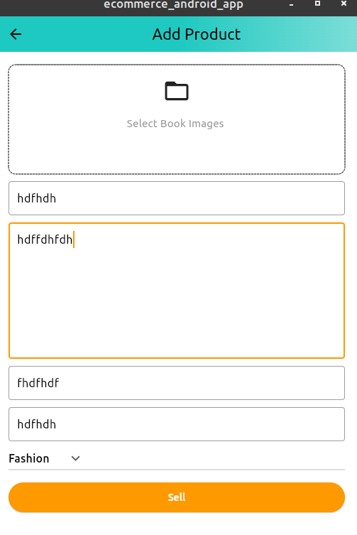

 

 

 

 > carousel slider when image is selected

> jsonDecode
 - --> Parses the string and returns the resulting Json object.
> jsonEncode 
- -->Converts [object] to a JSON string.

If value contains objects that are not directly encodable to a JSON string (a value that is not a number, boolean, string, null, list or a map with string keys), the [toEncodable] function is used to convert it to an object that must be directly encodable.

<!-- "products is missed so it messingwith other" -->

 httpErrorHandle(
        response: res,
        context: context,
        onSuccess: () {
          if (jsonDecode(res.body)['products'] != null) {
            for (int i = 0; i < jsonDecode(res.body)['products'].length; i++) {
              productList.add(
                Product.fromJson(
                  jsonEncode(jsonDecode(res.body)['products'][i]),
                ),
              );
            }
          } else {
            showSnackBar(context, "No products found in the response");
          }
        },
      );

      

